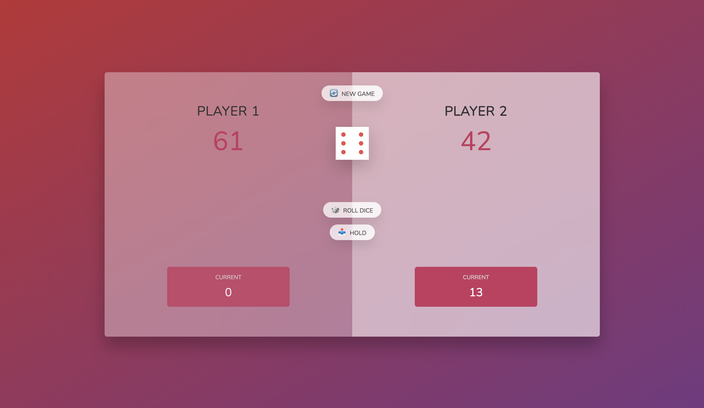
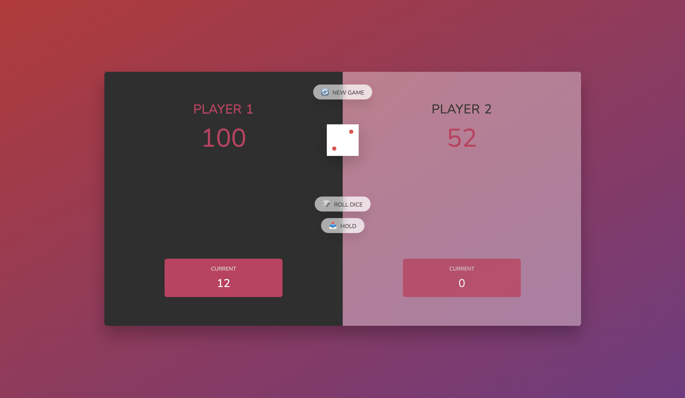

# diceroll

Advaced DOM manipulation concepts

      player0El.classList.toggle("player--active");  - toggle
      document.querySelector(".player--1"); - querySelector
      getElementById("current--0"); - getElementById
      scores = [0,0]; - scores stored in array

